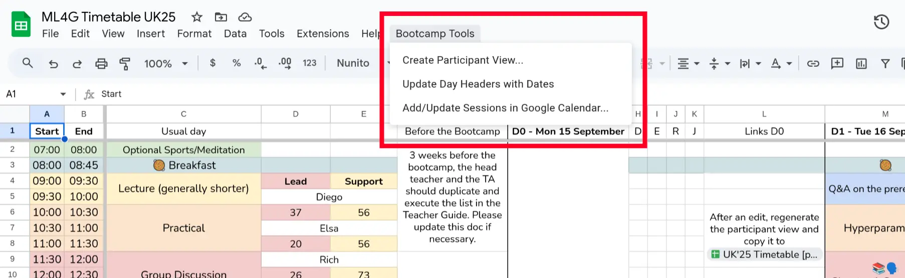

# Google Sheets Timetable Tools

This folder contains a Google Apps Script that adds the **Bootcamp Tools** menu to a timetable Google Sheet.



## Features

Once installed, this script adds a new menu called `Bootcamp Tools` to the Google Sheet's UI. This menu provides the following functions:

### 1. Create Participant View

*   **What it does:** Creates a simplified, participant-friendly version of the timetable, either in a new tab or in a separate Google Sheet.
*   **How it works:**
    1.  The script prompts you to select where to create the new view.
    2.  It automatically looks for a cell in your sheet containing `Participant View Sheet: <URL>`.
        *   **If a URL is found:** It offers a choice: update the target spreadsheet or create a new tab in the current one.
        *   **If no URL is found:** It explains how to set a target URL and defaults to creating a new tab in the current spreadsheet.
    3.  If the view is created in the same spreadsheet, the new sheet is named `[Original Sheet Name] - Participant View` to avoid overwriting the original.
    4.  In the new sheet, it **deletes all columns whose headers (in row 1) are not bold**. This allows you to maintain a detailed master schedule with internal notes while only showing participants the essential information.
    5.  The generated sheet is protected to prevent accidental edits.

### 2. Update Day Headers with Dates

*   **What it does:** Quickly populates dates for the entire bootcamp based on a start date.
*   **How it works:**
    1.  It prompts you to enter a start date for "D0".
    2.  It then finds all cells in the header row (row 1) that start with `D#` (e.g., `D0`, `D1`, `D2`).
    3.  It replaces them with a full, formatted date, like `D0 - Mon 24 March 2025`.

### 3. Add/Update Sessions in Google Calendar

*   **What it does:** Reads the timetable from the sheet and creates events in a Google Calendar.
*   **How it works:**
    1.  It prompts you to select a TA initial (or "ALL") to filter which sessions to add.
    2.  It asks you to choose an existing Google Calendar or create a new one.
    3.  It parses the timetable, reading event titles, start/end times (handling merged rows for duration), and TA assignments.
    4.  Before adding new events, it automatically deletes any events it previously created from *this specific sheet* to avoid duplicates.
    5.  It then creates the new events in the selected calendar.

## Setup & Deployment

To develop or deploy this script to a Google Sheet, you'll use `clasp`, the command-line interface for Apps Script.

1.  **Install Node.js & npm:** If you don't have them, install them first.
2.  **Install `clasp`:** Open your terminal and run:
    ```bash
    npm install -g @google/clasp
    ```
3.  **Login to Google:** Authorize `clasp` with the Google account that has access to the target Google Sheet:
    ```bash
    clasp login
    ```
4.  **Link the Project:**
    a. Open the Google Sheet you want to deploy the script to.
    b. Go to `Extensions` > `Apps Script`. This will open the script editor.
    c. In the script editor, go to `Project Settings` (the gear icon on the left).
    d. Copy the **Script ID**.
    e. In this folder (`meta/appscript`), create a file named `.clasp.json` and add the Script ID to it, like this:
    ```json
    {"scriptId":"YOUR_SCRIPT_ID_HERE"}
    ```

## Development Workflow

1.  **Make Changes:** Edit the `.js` files in this directory locally in your code editor.
2.  **Push Changes:** When you're ready to test, push your changes to the Google Sheet:
    ```bash
    clasp push
    ```
    This will upload the latest version of the code to the script project linked in `.clasp.json`.
3.  **Test:** Reload the Google Sheet. The `Bootcamp Tools` menu should reflect your changes. You can also view logs in the Apps Script editor under `Executions`.

## What is Google Apps Script?

For those unfamiliar, Google Apps Script is a cloud-based scripting language based on JavaScript. It allows you to create custom tools and add-ons for Google Workspace applications like Sheets, Docs, and Forms. Think of it as macros or VBA for the Google ecosystem. We use it to automate repetitive tasks directly within our timetables.
